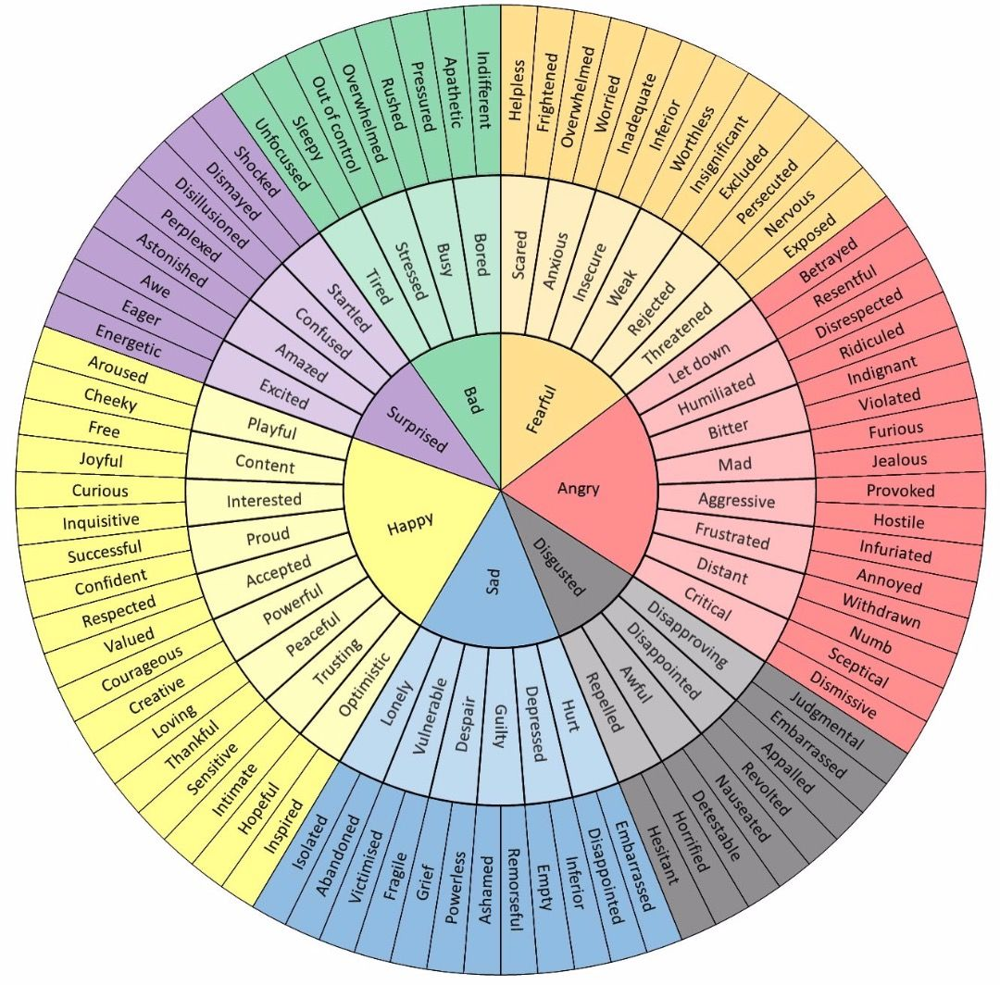

# Modeling The Brain

You are about to learn how to "debug your brain", making yourself happier and more effective. You will end up with a systems-thinking way to view yourself, a mental model of your mind. <!-- #content: define systems thinking. I do later, should I pull it forward, or punt using this term right away? -->

There are activities at the end of some sections --- you will learn the most if you actually do these.

Who is writing this? Hi, I'm Casey! I studied neurobiology at Yale University. I am a co-author on a few neurobiology papers  [^caseypapers]. I have also worked in software development for 10 years.

[^caseypapers]: @maddoxNaturallyoccurringHistoneAcetyltransferase2013; @maddoxP300CBPHistone2013; @maddoxDNAMethyltransferaseActivity2014

## Goals

Do you want to be a happier and more effective person? Of course you do!

The brain debugging techniques in this book will help you choose the best response for a given situation. This is especially difficult when you are experience a _downward spiral_, where you just feel worse and worse. Downward spirals often happen in high-stakes or emotional situations. <!-- #content define downward spiral here, earlier instead of later? "where you might enter a downward spiral?" -->

These techniques will help you understand yourself better, will help you understand other people better, and will help you communicate your mental state more clearly as well. They can even help you understand other perspectives more readily and quickly.

When you are on autopilot in a stressful situation, you may end up with an undesirable outcome. You might not convey your ideas clearly, and you might damage your relationship with the people involved. <!-- #content "This sentence could be fleshed out a bit more. I;m trying to understand if it is that not conveying my ideas clearly would lead to me potentially damaging my relationship with the people involved OR if they are supposed to be two different sentences. If they are two different senteces, I would want some context as to why not conveying my ideas clearly may be so undesirable. From reading the sentence it looks like you may have had a particular stressful situation in mind, which would make sense if it weere explained, or given as an example.
" -->

When can you apply these techniques? Either in the moment it is happening, if you catch yourself, or after the fact when you can reflect back on the situation. You might be able to change the outcome of the current situation, or you might at least set yourself up to have a more desirable outcome if a similar situation arises in the future.

## Opportunities

Here are three examples of situations where brain debugging would help. Each of these bad situations <!-- #content "what makes these situations bad?" --> might end up with a desirable or undesirable outcome. Later we will get into what you might do to make yourself more effective in each of these, getting a more desirable outcome.

### Work Disagreement
Imagine you are at work and you have an idea, and your coworker has a different idea. You do not agree. You are having an argument, and it gets heated. You both believe very strongly that your idea is the best one for the situation. Hopefully your team will end up making the choice that is best for the situation. This topic will likely come up again --- what can you do better next time?

### Leaving The Door Open
Imagine you are a parent, and your kids forgot to shut the front door --- again! You snap at them. You later feel guilty for snapping. It was not the most effective way to change their behavior in the future, and they got upset right back at you. You know you could have done something differently, but it was hard to in the moment.

### Hangry Meet-up
Once I was headed to a meet-up. I had not eaten dinner yet and I found out there was going to be NO PIZZA at that meet-up. It was raining. I stepped in a puddle. I thought to myself "everything is the worst". All of a sudden I could not imagine going to the meet-up anymore --- and that would have been a shame, because I was really looking forward to it. I managed to catch myself, and I corrected this in the moment. I told myself that my wet/hungry state could both easily be fixed, and I convinced myself to go. I am glad I did!

## Inner vs Outer Brain
<!-- #content "I think some sort of transition between the examples and this next piece would be helpful. You start to go into the brain and as a reader I'm unable to understand the connection between the two.
"  -->

Some believe that left-brained people are more inclined to be creative, and right-brained people are more inclined to be analytical. Analytical vs creative may be a useful dichotomy, but these traits do not seem to stem from the two hemispheres of the brain. The difference between these two halves of the brain is often exaggerated. Here is <!-- add this in a citation format; move to bottom of this section if I do not go into it --> [one study](https://journals.plos.org/plosone/article?id=10.1371/journal.pone.0071275) that goes into this in some depth.

A much more useful dichotomy is the inner brain versus the outer brain. What is the difference between these two halves?

<!-- #content update the example, maybe use snake/stick one since the gif will not work here? can still point to "cats and cucumbers" they can google it lol -->

You can see the difference in the two paths with this example with cats:

*A cat by its cat-food bowl turns around, sees a cucumber on the ground, and then jumps in fear. The cat likely realizes it is just a cucumber moments later*

This illustrates the _Dual Pathway Model of Fear_ (LeDoux). I am using fear here as a vivid example, but the core idea applies to non-fear emotions as well.

The _low road_ path is much faster than the _high road_ one. <!-- #content I think having a transition sentence would be helpful, as the paragraph makes me uncertain if the different paths are involved in the "Dual Pathway Model of Fear". If this is the case, you could say something along the lines of "The Dual Pathway Model of Fear is characterized by a "low road" and a "high road"." I like how you mention that the "inner brain" is the Limbic System, and while you mention the cortex later on, I think mentioning it here would be okay.
 --> The low road processes emotions very quickly, on the scale of milliseconds. It only has to go through the _inner brain_ (limbic system), which is a much shorter path. Humans and animals both have this part of the brain. It is older than the _outer brain_ in evolutionary terms. The inner brain is where fear is experienced.

The _high road_ is much slower. Thoughts are processed more slowly, on the scale of seconds. It has to go all the way through the _outer brain_ (cortex), which is a much longer path. The cortex is the part of the brain humans actually think in --- your conscious mind. Humans have the largest cortex relative to brain size --- much larger than animals. Some people like to oversimplify and claim that animals cannot "think" --- that they do not use their cortex in the same way humans do. <!-- #content I would add your opinion here, or add science here. I think that leaving that statement makes me feel that you believe that animals can't think. Alternatively, I don't think that sentence really adds much to your argument.
 -->

<!-- #formatting: table formatting -->

| low road      | high road   |
|:-------------:|-------------|
| inner brain   | outer brain |
| limbic system | cortex      |
| faster (~ms)  | slower (~s) |
| feelings      | thoughts    |

To summarize, _inner brain_ feelings are processed much more quickly than _outer brain_ thoughts are. We tend to feel first and think second.
<!-- #content I think changing the wording here would be beneficial, as the summary is misleading and makes it seem as though feelings could also be in the "outer brain". For example if the sentence said "To summarize, feelings are processed significantly faster than thoughts." As a side comment, what is your intent with using quotation marks for inner and out brain? Generally speaking, these terms don't use quotations. -->

## Systems Thinking

### IPO Model

<!-- #content I think having some sort of transition would be helpful here as well. Maybe at the end of the previous paragraph you can allude to Systems Thinking.
 -->

Developers, engineers, and scientists are great systems thinkers. Whether or not you identify with any of these, you can be a systems thinker too! One of the most common and simplest systems models is the IPO Model. <!-- #content My first question is, what is a systems thinkers? While mentioning that the different types of people are great at it, I don't know what it means.
 -->

<!-- #images You probably already know, but I would include a better graphic. The arrows over extend into the bubbles, and the curve of the arrow on top could be smoother. I would double check the style, but would suggest capitalizing feedback, and maybe also make it purple. Since you mentioned that feedback is not always included, maybe using a dashed arrow for that piece would also help to convey that message.
  -->

*The IPO Model*

IPO stands for input, process, and output. The IPO Model contains those three steps, and sometimes also a feedback loop. <!-- #content I would take the time to explain what the four components of the model are early on.
 -->

A textbook example of the IPO Model is the thermostat in your home. The thermostat measures the temperature of the room (input). It then compares that temperature to the set temperature, determining if it is above or below the temperature you set (process). It then toggles the heater on or off accordingly (output). The temperature of the room changes, and eventually the cycle repeats (feedback loop).

I learned about this model in a middle school engineering class, and it was my first exposure to systems thinking. I nicknamed this simple model The Engineer's System Diagram at the time, and only later learned to call it the IPO Model.

You can apply the IPO model to software development --- it maps pretty cleanly to a function.  A function accepts arguments (the input) and returns a return value (the output). Some code happens inside the body of the function (the process). Calling the function also affects other things in the software, which sometimes calls the function again (the feedback loop).

### Systems Thinking & Conscious Thought
We can use the IPO model to model brains, too!
<!-- #formatting refer to do as dog not it -->
The simplest form of this diagram is just input and output. Imagine a simple model of an animal that says they do not really _think_ --- they just respond to their environment.

The classic Pavlov's Dog idea uses this model. The dog is trained to associate a bell being rung with being fed. After this conditioning, every time the bell rings, the dog salivates --- even if there is no food around. The dog does not have to decide whether to salivate. Salivation is an automatic reaction the dog has to an external stimulus. This phenomenon can be referred to as _Pavlovian conditioning_ or _classical conditioning_.

In an oversimplification, we can imagine that there is no conscious _process_ going on inside the animal. In contrast, we believe we humans always have conscious thought --- we think thoughts and feel feelings in a conscious way.

*Model of an animal: input leads to output. Model of a human: input leads to process leads to output.*

But we humans are not always so aware of what goes on inside our heads. When we are on autopilot, the animal model we just discussed (with no process step) seems more appropriate. On the other hand, when we are more mindful that is when we are consciously aware of our thoughts and feelings. When mindful, we have more influence over the _process_ part of this system.

*Model of autopilot: input leads to output. Model of mindfulness: input leads to process leads to output.*

### Automatic vs Deliberate Thoughts and Feelings
<!-- #formatting quotes to italics -->
You experience both _automatic thoughts_ and _automatic feelings_ --- they both just happen "to" you. From the perspective of your consciousness, they are inputs that you cannot control.

When you are being mindful you can then actively choose to have _deliberate thoughts_ and influence your feelings. You can probably imagine how to have a _deliberate thought_ --- you just think it!

As for feelings, you  cannot will yourself to experience a specific feeling directly. You can, however, influence your feelings based on the deliberate thoughts you think. This influenced-feeling is partially deliberate. This is partially within your influence, but not within your (direct) control.

|         | automatic         | deliberate         |
|:-------:|-------------------|--------------------|
| thought | automatic thought | deliberate thought |
| feeling | automatic feeling | influenced feeling |

### Downward Spiral
Sometimes these automatic or deliberate thoughts and feelings can cause a troublesome feedback loop --- a _downward spiral_. A downward spiral is a feedback loop of negative thoughts, leading to negative feelings, leading to more negative thoughts, etc.

*A downward spiral. Negative thoughts leading to negative feelings leading back to more negative thoughts.*

For example, that time when I stepped in a puddle on my way to a meet-up event. That made my already-bad mood even worse. I heard myself automatically think something like "I am stupid," and that kicked off a downward spiral for me.

A downward spiral like this is not usually so useful. It manages to both make you feel worse AND distract you from focusing on things that are important. We generally want to avoid downward spirals.

If you effectively influence your mind, you can often control whether you let this happen to yourself or not. You will become more effective, think more clearly, and choose a better response more often.

## Activities

- Think about times you wish you had behaved differently. Look out for opportunities where debugging could help you end up with a better outcome.
- Draw out the IPO Model from memory.
- Try to explain _inner brain_ vs _outer brain_ to a friend or coworker.

# CBT, Introspection, and Inputs

## Cognitive Behavioral Therapy

Do you want to be a happier and more effective person? Try Cognitive Behavioral Therapy!

Cognitive Behavioral Therapy (CBT) is a specific and common form of talk therapy. CBT is effective for depression, anxiety, general stress from work, and much more!

The core idea is that certain thought patterns contribute to emotional distress and behavioral issues. These _cognitive distortions_ offer an inaccurate view of the world and/or yourself, and they can be changed and improved with practice and effort. The term _cognitive distortions_ is usually used interchangeably with _maladaptive thought patterns_ and _maladaptive cognitions_. <!-- #content too many ands in this sentence which hurts the flow. I would recommend restructuring the sentence
 -->

The full list of mental problems CBT can help with is quite long --- more than fifteen! Here is one source that lists a bunch of them: @hofmannEfficacyCognitiveBehavioral2012. CBT is not necessarily the best or only therapy for every single one of these mental problems. It is, however, one of the most frequently used techniques, and it is often very effective.

You may be wondering "Do I need to have a mental health issue for CBT to help me?" Nope! The use of the word "therapy" here can be a bit misleading. Whether or not you have any mental health issues, CBT can help you be more happy and effective.

### Therapy? Training!
I think of CBT more like "brain training". To reduce its association with therapy, I sometimes call it "Cognitive Behavioral Training" instead of "Cognitive Behavioral Therapy". Many people I know find this title much more approachable. The stigma around mental health seems to be getting better over time, but that stigma is certainly still around. These techniques help whether or not you have any mental health issues. It is definitely helpful to understand how to process your thoughts and feelings better.

If you are at all unsure whether you would benefit from ("need") actual therapy, I recommend you see someone to be screened. Please do not treat this book as therapy — this is not a suitable replacement for the real thing.

### More about CBT

This book applies "systems thinking" (like the IPO model) to Cognitive Behavioral Therapy. If you are interested in digging deeper into CBT after reading this book, I suggest the book "Feeling Good" by David Burns <!-- #citation feeling good -->. In one study, "Feeling Good" was the most commonly prescribed reading assignment from therapists doing CBT with their patients. In another study, it was found to be as effective as actual therapy for some people. <!-- #citation Uncertain for your need to be this scientific about the book. However, if you are going to mention the study, I think you should cite it.
 -->

### Positive Outcomes

In my mind, there are two tangible positive outcomes from processing experiences. One is _learning_, and the other is reducing involuntary, unwelcome _intrusive thoughts_.

If you can learn something from a situation, that might help you in a similar one. By "learn" I mean either something specific like "always make sure you have your keys when you leave the house", or something abstract like "try slowing down and be more careful".

Processing can also help reduce intrusive thoughts. Imagine a job interview. After the interview you are not sure how it went, and you think about it a lot. You play back what everyone said and did, thinking about what you could have done differently. This is probably some amount helpful, and some amount unhelpful. If these thoughts continue happening to you at inappropriate times, you might consider them "intrusive thoughts".

How can you put unwanted thoughts to rest? For a particular experience, try to find value in it by learning something. If you are not sure there is anything further you can learn from it, it may help to try accepting it [Wells 2014](https://www.ncbi.nlm.nih.gov/pubmed/25243365) <!-- #citation Wells 2014 -->. Finding value or finding acceptance can help reduce the frequency of the intrusive thoughts.

<!-- #content explain the software use case, and then connect it -->In software terms, intrusive thoughts are a bit like metrics and alerting. The subconscious mind sets up these alerts for itself. It decides that some experiences are important to process, and alerts you of those until they are fully processed. Addressing the root issue can often make it so the alert is not fired off as often, or at all.

## Hitting Your Debugger

When can you process an experience? It could be during, immediately after, hours after, weeks after, or even years after. How do we get into an introspective state to do this processing/debugging? It depends on whether you are debugging during or after the stressful situation. Each is valuable in its own way.

### During

If you are able to debug your brain during a stressful situation, you may be able to change the outcome of that situation. You may also be able to make this current experience a less stressful one.

Many people find it difficult to realize when it is a good opportunity to introspect in-moment. We will go through a technique in the next section to help with noticing opportunities for introspection and getting you into that introspective mindset.

### After

When you debug your brain after an experience, you may learn things that can help you in a similar situation in the future. This post-processing can also help reduce how often you think of the situation, and how stressful it is to think about.

## The Whoop Technique

### A Ripe Situation

To start up your debugger in the moment, I recommend the _whoop technique_.

One day, my mother snapped at my younger brother for leaving the door open. Immediately after, she felt bad and apologized. She told us she really did not know why she yelled about "such a small thing". After thinking about it for a bit, she realized that she had not eaten that day. She was pretty hungry. That hunger affected both her mood and her response to my brother. After she ate some food, she felt much less irritable. I am really proud of her going through this whole thought process — great job, mom!

### Whoop!

This was not the first or last time this sort of thing would happen. My mom wanted to get better at this — better at noticing things like how her hunger, thoughts, and emotions can affect her mood. Once she got into that introspective state she could figure it out well enough, but she had trouble getting into that introspective state in the first place. In programming terms, she had trouble hitting a "debugger breakpoint".

My mom asked us to help her next time she got frustrated or upset like this. We brainstormed, and decided that next time we could loudly yell "WHOOP!". After the whoop, she might enter an introspective state (the _whoop state_) and try processing the experience. Or, she could say "not now" and we would move on. She whoops herself, I whoop myself, my brother whoops himself. We all whoop!

Hopefully this story makes the whoop technique memorable for you. Yelling whoop is both helpful and hilarious. A whoop surprises you out of your current mindset. If you were about to spiral downward, it halts that for a moment. It puts you into a different mental state where you can be ready to think about what made you so frustrated in the first place. For my mom, it was not really what my brother was doing — she figured out it was more about her hunger. We will cover more things that might affect your mood later in this chapter.

This technique is most useful for whooping yourself: either out loud, or quietly in your head. If you want to recruit friends or family to support you that is great, but definitely optional.

<!-- #content "The Whoop! section is excellent…But I missed out on how exactly one should use the technique. After reading through, the whoop technique seems to work in any stressful situation, but I was left wondering “okay is it really better to say it out loud…Is it more of a feeling thing? Does the word itself lend the solution or the feeling?” - Page 21 - 22" -->

In programming terms, a "whoop" is like hitting the "debugger breakpoint" where you can take a moment to "inspect" what is going on. From here you can inspect local variables, global variables, the call stack, and even run some code that will affect the program even after you leave the breakpoint.

### Whoop Practice

It takes a lot of practice to get good at noticing when introspection will help. Just being able to notice opportunities is a huge step forward. Whenever you get into this introspective state (_whoop state_) I want you to congratulate yourself. You will get better and better the more you do this. Be patient with yourself in the meantime.

### When Not To Control Your Thoughts?

It takes both time and energy to introspect. If you do not have the time or energy to introspect as much as you would like, that is okay and normal. Sometimes you may enter the "whoop" state briefly, decide it is not worth introspecting right now, and leave before processing things. If that feels right, that is totally okay.

You want to prevent most downward spirals. Most downward spirals are are a waste of your time and energy or lead to actions you may regret. However, sometimes it might be worth it to let yourself get worked up --- you might be driven to focus on something you would not otherwise.

For an example, once I got really upset in a food court. I was eating a meal, charging my phone, when a security officer rudely told me I could not use the power outlet. I felt myself getting worked up, I whooped internally, and I entered an introspective state. I considered — should I control my thoughts and feelings and prevent myself from being worked up? In this case, I decided to allow this to motivate me to act.

I was energized enough to talk to the manager and make my thoughts known. I explained: it cost virtually nothing to the company (literally <$0.001 for a full phone charge). I was not in the way of anything. I was not taking up needed space (the food court was empty). There was no sign up about this rule anywhere. And the person asking me to unplug was rude about it.

I introspected enough to be able to describe my experience clearly, but not so much as to diffuse my motivation. I want this information (the story of my experience) to make it to someone who could potentially do something about it. If they don't have access to this information, how could they make it better? I am proud to be someone who can calmly and clearly share context like this, and then let it go. I do not expect other people to feel this way, but I often feel compelled to share context like this.

You can become very skilled at introspection and still allow yourself to get worked up sometimes. You do not need to always mechanically control your thoughts.

Imagine that you are now an expert at using the whoop technique to get into an introspective state. What can you do next?

## Post-hoc Rationalization

When my brother did not close the door, my mom stopped to introspect for a moment. If she had not, she might have explained her behavior in an unsatisfying, inaccurate way called a _post-hoc rationalization_. Post-hoc means "after the fact". We often experience a gut reaction first (inner brain), and then afterwards attempt to explain our thoughts and feelings quickly (outer brain). Often the quick attempt at explaining it is inaccurate or incomplete. This could cause internal conflict for yourself, or conflict with others.

Some blatant examples: "he always does that!" (even if he has not done it much) or "he's going to let all the heat out!" (even if the heat was off). Post-hoc rationalization can happen during stressful or non-stressful situations. It can happen anytime. <!-- #content clarify that it happens after the emotion, but it can happen during the event "For clarification, if it is a post-hoc rationalization, it would not occur during the stressful or non-stressful situations --- it would always occur after the fact.
" -->

When you find yourself experiencing this, consider taking a moment to introspect. Your first explanation may be inaccurate, but your gut feeling is likely rooted in reality in some way. By spending time processing you may be able to come up with a fuller, more satisfying explanation for yourself and for others. Whoop!

## Identifying Inputs
<!-- #content "Truthfully, I would suggest a different sentence to start this section. It feels strange to mention the IPO model without some context. Even a little context beforehand may help the flow." -->

We will go through our IPO (input, process, output) model of the brain in sections. The first section will be about inputs in general, the next section will go in depth about processing feelings, and the final section will go in depth about processing thoughts. Once you process everything, you will be well-equipped to choose the most adaptive response (the output).

There are at least four categories of input to your system: automatic feelings, automatic thoughts, external stimuli, and your current bodily state.

### Automatic Feelings
<!-- #content feelings vs emotions? "I'm not certain if you mean feelings here or emotions. For reference check out https://counseling.online.wfu.edu/blog/difference-feelings-emotions/
https://online.uwa.edu/news/emotional-psychology/" -->

Any feelings you experience are a type of input. A feeling can be present whether you can accurately describe it in words or not. A feeling can sometimes come with automatic thoughts describing it, but sometimes it would not.

This might encompass a feeling you get in a particular moment like a moment of fear, or a low-level background feeling like being anxious for a day. The specific distinction between these two is not super important — it is more important that you scan yourself for both kinds.

### Automatic Thoughts

An automatic thought is one you do not actively choose to think. You just "hear" the thought as it appears in your head. My mom automatically thought the words "Oh, not again!!". This automatic thought came to her around the same time as an _automatic feeling_ of frustration. Both automatic feelings and automatic thoughts are inputs to the conscious part of your brain. These are not directly under your control.

### External Stimuli

External stimuli are anything that happens outside of your body or mind. Events that happen around you — like my younger brother not shutting the door. It could be some event from earlier in the day, like if you wake up late or miss a cup of coffee. It could be something someone said to you the day, month, or year before. These events happening to you are separate from any thoughts or feelings you have about these stimuli.

### Bodily State

A fourth type of input is your current bodily state. My favorite example is the word _hangry_ — short for hungry-angry (a portmanteau!). If you are _hangry_, that means your state of hunger is leading you to experience anger, and you may respond to the situation with anger. When my mom realized she had not eaten, she apologized to my brother, moved on, and got some food.

I am so glad _hangry_ has become such a common term. I would love to have an even richer vocabulary like this. I have not come up with any mashup words that are quite as catchy as _hangry_, but hyphenation helps me a lot. Instead of pushing for "tiredrated" I just use tired-frustrated instead. Any [bodily-state]-[emotional-state] combination is a possibility. For myself, I distinguish between [many types of hungry](https://caseywatts.com/2017/12/18/types-of-hunger.html) (stomach-volume-hungry vs sugar-hungry vs thirsty-hungry and more). I distinguish between many types of tired (physically tired vs sleepy-tired vs socially drained vs focused-for-too-long drained).

Those are four types of input: automatic feelings, automatic thoughts, stimuli from the environment, and current bodily state. Now equipped with all this context, we are ready to start processing these emotions and thoughts.

## Activities

- What are the four major types of inputs to your consciousness?
- Practice the "whoop" — whoop yourself 3 times today. While in this introspective state, notice your inputs. Identify inputs from each of the four major types of inputs.
- Explain CBT (at a high level) to a friend. Do a bit of independent research (Googling!) if you want to be able to speak about it more accurately.
- Use the term "post-hoc rationalization" in a conversation this week.

# Experience Processing

## Overview

### Experience Processing

In this chapter, "Experience Processing", you will learn specific techniques to help you process experiences by putting them into words. Verbalizing an experience can help reduce the stress you feel about a given situation. It can help you feel more in control and at ease. It can help you express your experiences to others. It can help you choose the best response for the situation. You also get the opportunity to influence your future thoughts and feelings, through deliberate thought.

Putting the experience into words can be a huge relief, especially when the experience is complex or troublesome.

Words give us "handles" that we can use to inspect experiences. We can use these to investigate and figure out what is really going on. By using accurate language, we can process experiences a lot more deeply and effectively than we can by using abstract wordless thoughts alone. You might verbalize an experience by thinking to yourself, by talking to a friend, or by writing.

We will cover six concrete techniques to help you process experiences more fully and effectively.

<!-- #content list the six here -->

<!-- #content "What are the six concrete techniques? From reading this chapter it's hard for me to identify. I see 1. Avoiding Rumination 2. Processing Experiences 3. Rubber Duck 4. Writing 5. Meditation 6. Reading Fiction.

I'm assuming that Emotional Vocabulary is not a part of the 6 techniques. If this is the case, you may want to have a section where you definitively mention before the start of that section that Reading Fiction is the last of the six techniques and to then have a transistion sentence to Emotion vocabulary. It would also help to identify what the six are in the beginning." -->

### Automatic Inputs as Data

In our IPO model of the mind, automatic thoughts and automatic emotions are inputs to your system. Strive to accept your automatic thoughts and automatic emotions as inputs. Accept these as data, without judgment.

"You" are your conscious mind. Your conscious mind is the "process" part of the IPO model, at least when you are being mindful. Your conscious mind cannot control or influence its automatic inputs.

When you accept automatic inputs as data, you can process them more fully. When you instead fixate on and judge these inputs, that can be very counterproductive. <!-- #content more than just counterproductive? make stronger-->

It can take a lot of practice and training to accept emotions as input. It will get easier with time and repetition. If you want to practice this deliberately, you might consider a meditation practice. Many meditation practices actively focus on observing thoughts and emotions non-judgmentally.

### Avoiding Rumination

When processing thoughts and feelings, there is a risk of accidentally ruminating on them instead of effectively processing them.

<!-- #image insert rumination image -->

Rumination is when you focus on the causes and consequences of a problem. When you are too fixated on the negative, it may cause a downward spiral and make you feel even worse. If you notice yourself ruminating, you may want to take a break and try again later. If you are not careful, you could accidentally reinforce maladaptive thought patterns.

With practice, you can develop techniques to effectively process experiences instead of ruminating on them. One technique is accepting inputs as things you cannot change. Another is identifying and countering maladaptive <!-- #content when do I define maladaptive, and when do I use its synonyms? --> thought patterns, and we will cover those in the next section.

## Processing Experiences

<!-- #content "As this is the start of a new sub-section broken into different parts. I would include some text instead of jumping right into Talk with a friend." -->

### Talk with a friend

Talking through an experience with a close friend is one of the most powerful processing techniques. This is also my personal favorite. Not only is it helpful for processing the experience, but it is also a bonding opportunity for the relationship.

You have to put your thoughts and feelings into concrete words in order to communicate them to another person. If your friend can accurately reflect back to you what you are saying, that helps you be more confident that you are understandable. This confidence can help you feel more settled about that part of the experience. This can help you move on to processing other parts of the experience.

Sometimes a friend will describe something in a different way than you. If you like their phrasing, you might adopt it yourself. When you sometimes have trouble putting an idea into words, a friend can help you explore those. They might brainstorm different ways of describing it until something feels accurate and correct. If you especially like a particular phrasing you might even write it down to reference later.

Here is an example of how I process experiences with a friend.

1. I ask the friend if they can help talk me through something. This makes sure they are available to help me process my unprocessed thoughts before diving in.
2. When sharing unprocessed thoughts, sometimes I end up rambling a bit. It can take a few tries to figure out the right word. For example, I might try: "I feel good about it. Excited maybe? Not quite excited. I do think it'll go my way, and that's a comforting feeling."
3. When I am having trouble, my actively listening friend might suggest "are you feeling confident?". If they are right, we've named this feeling! If not, we can continue on until some description feels right. Often you can find a single word for something. If not, you can at least find a phrase or sentence-long explanation of the feeling.

If they can reflect back to you accurately how you are feeling, that can make you feel understood by another person. It can be very comforting, validating your experience as understandable. This can help you feel like you can move on, now that the experience has been processed.

Talking with a friend is often the most powerful method of processing an experience, but talking with an unsupportive friend could make you feel worse. A friend might inadvertently invalidate your experiences, making you feel more uncertain about the experience. <!-- #content this can be from your relationship, or the person is generally supportive or not, or if they have related experience etc sure - but it's also a **skill** you can learn! someone motivated can learn how to be actively supportive -->
<!-- #content sometimes talking with a friend can be counterproductive, making you feel invalidated. An unsupportive exchange can... (not focusing on the person, but the interaction itself) -->

There are many tactics you can use to make your friends feel validated when listening to them, covered later in the book. If you can be a good model of active listening and effective validation, it may help your friends learn how to support you in a helpful way.

### Rubber Duck
<!-- #content consider moving this to after reading fiction (Adrian) "**I didn’t really feel the flow into the Rubber Duck section after the Talk with a Friend section. I would recommend moving this to the end… After Reading fiction. I think the flow would read a lot better. The content itself though was spot on and had the “Casey flair!”*" -->
Not ready to talk to a friend? Try a rubber duck!

The "rubber duck debugging" technique is a common software development trick. Put a rubber duck on your desk, or imagine one. Pretend the duck is sentient and explain the situation to it. Imagine what questions it would ask, and what information it would need to know to be able to help. You could imagine the duck has the same context a coworker would have, or no context at all.

You can have a full-on conversation with this duck out loud, in your head, or in writing. By explaining the situation with words, you will understand it more clearly yourself, too. You may realize some assumptions you are making, and be able to enunciate them. Often the root of the issue can be found within assumptions.

You can choose the identity of this imagined-audience to meet your needs --- they could have similar context to a coworker, or someone else like your manager, your best friend, a family member, etc. And if you cannot think of an existing person who would be particularly appropriate, you can even imagine up someone new.

#### Duck vs Friend

Sometimes you may want to talk to a duck before a friend. The duck can help you think of what questions the friend would ask to get context, and what assumptions you are making that would be helpful to make explicit.

The duck can help you "pre-process" your thoughts, putting it into words as much as you can on your own. Putting the experience into words can help you explain it more accurately, clearly, and succinctly. The more you can enunciate on your own, the smoother and deeper a discussion with a friend will go.

Often just by thinking through with a duck, I end up discovering exactly what I needed to know to figure out the situation. Often, I end up not even needing to talk with a friend at all. You can get a lot of the benefits of talking with a friend by talking with a duck, and without taking up another person's time.

Even though I use this technique so often, I am still so surprised every time it helps. It really does.

### Writing
<!-- #formatting revisit ordering numbering in the text, or remove it-->
Writing is the third tool in your toolbelt. Writing can help you go even deeper on an issue than just talking or thinking. Writing activates a different part of the brain, and makes you really nail down thoughts and feelings. When you take time to write, you can also focus more on using accurate terms.

To start, you might "brainstorm", writing down everything in a stream-of-consciousness way. Just putting your thoughts and feelings into words, even if they are not very accurate to start. After brainstorming, you can then re-read and edit it until it feels accurate. Some parts will likely feel "off" on your first try, and you can iterate on them. Try to use the most specific words you can, especially for emotions.

I use the term journaling to mean "writing out thoughts and feelings", wherever and whenever that is. This is useful even if you do not write those thoughts and feelings in a notebook every day before bed.

You do not need a physical journal to practice journaling. Some people prefer digital journaling using a computer or phone. My favorite place to journal is in an email draft message. It is quick to load and does not have any frills to get in the way. Often I will start an email draft imagining I would send it to a coworker (but with my name in the "to:" to be safe).

You can write to yourself, future-you, past-you, or to the journal itself. You could write to your rubber duck, your best friend, or anyone.

### Meditation

Practicing meditation can help you become more aware of your thoughts and emotions. Unlike many of the other techniques, meditation is not great for actively thinking about and processing experiences. It is useful for becoming aware of thoughts and feelings in the first place and accepting them as inputs, so that you can process them later.

If you would like to try getting into meditation, there are a lot of resources to help you get started in a gentle and gradual way. My favorite introduction to meditation is a mobile app, "Headspace". It introduces meditation concepts one at a time, using voice guidance and cute little video animations.

<!-- #content add it "a common ~mantra of meditation practices is to not judge your thoughts and feelings, but to accept them as inputs" -->
Rumination is a risk with meditation. Sitting with these normally-unseen thoughts and feelings can be stressful. Stress is more likely to happen when in a particularly challenging situation, or when mentally or bodily fatigued. It is easy to judge these and accidentally kick off a downward spiral, making yourself feel worse. This risk is especially high for beginners. With practice, you will get better at not judging your thoughts and feelings.

### Reading fiction

Some people believe that nonfiction reading is more useful than fiction reading. Nonfiction books teach us facts. But both are useful in their own way. Nonfiction books may teach facts, but fiction books are useful for social and emotional development.

Fiction books give you the opportunity to peer inside another person's mind. You get to see how the characters interact with others and the results of those interactions. The characters often act in ways we would not ourselves, and in situations we could never find ourselves in. Even in similar situations, a character's thoughts and feelings are often quite different from how you yourself would react in that situation. Reading fiction helps you imagine ways in which other people think.

The only way an author is able to convey these thoughts and feelings is to use words. If you can pick up on their wording or vocabulary that can help with your own wording and vocabulary.

Some research has been done on this phenomenon, using the "narrative transportation theory". The term "high emotional transportation" means a story where the reader imagines they are immersed in the world, empathizing with the characters more deeply. [Some studies](https://www.ncbi.nlm.nih.gov/pmc/articles/PMC3559433/) show that people who have recently read "high emotional transportation" books have greater empathy than those who read something without high emotional transportation.

Try reading some fiction! You do not need to read from a high school English class curriculum; today's popular fiction totally counts. If you need an idea, maybe start with something from the top 10 bestsellers list for this year. You probably even know some people who have read one of those, and you can bond over that.

### Emotional vocabulary

Children are usually taught the most simple emotions first --- like happy, sad, angry, tired --- and later they learn how to describe more complex emotions. You understand many more words than you regularly use, and this applies to emotional vocabulary as well. With practice, you can learn to wield a much richer emotional vocabulary.

Enriching your vocabulary can help you with both automatic and deliberate thoughts/feelings. The more you use accurate vocabulary in your deliberate thoughts, the more your automatic thoughts will use them as well. When you are monitoring your thoughts actively, the line between automatic and deliberate thoughts can be blurry, and that is normal. Each small nudge in the right direction adds up. <!-- #content revisit this paragraph, it has multiple topics going on -->

You can use an emotion thesaurus chart to expand your emotional vocabulary. Keep a reference like this one somewhere handy; print this one out, or save it to your desktop. There are many more resources like this online --- some in circular graphs, some with more colors.

The next time you are trying to describe your emotions, whether to yourself or to someone else, try using the reference. You may find a word a little more accurate than what you would think of naturally. You might also try a traditional thesaurus, or ask a friend how they would describe it. 

## Activities

* Print out the emotional vocabulary chart [from this article](https://hbr.org/2016/11/3-ways-to-better-understand-your-emotions), to have it handy next time you need it. If you cannot print it, make it accessible somehow: save it to your desktop or email it to yourself and star it.
  * Look for others to print, too --- there are a lot of these available.
* Try processing emotions a bit each day this week. Try a different tactic each day this week:
  * Schedule a time with a friend to talk about your feelings
  * Discuss a problem with a "rubber duck" for 10 minutes
  * Journal for 10 minutes once
  * Meditate (at least 3 sessions). Perhaps using the [Headspace app](https://www.headspace.com/) for guidance.
* Read more about the Six Levels of Validation
  * This [high-level overview article](https://www.psychologytoday.com/us/blog/pieces-mind/201204/understanding-validation-way-communicate-acceptance)
  * Or [this original source (download pdf)](https://www.researchgate.net/publication/232561580_Validation_and_psychotherapy) from "Validation and Psychotherapy" by Marsha Linehan, 1997.
* Choose a fiction book to read. An audiobook counts just as well.

# Validation

## Close Relationships

There is a recent ["loneliness epidemic" in the US](https://www.cigna.com/newsroom/news-releases/2018/new-cigna-study-reveals-loneliness-at-epidemic-levels-in-america). Many people do not have many close relationships with people they can have intimate discussions with. If this sounds familiar to you, consider making it a priority to cultivate deeper relationships. It can be difficult, but it is well worth the effort.

<!-- #content I would give one or two studies as an example. You could start with "Studies such as XX and XX have shown..."
 -->

Studies show that the more close connections you have, the healthier you are, the longer you live, and the more resilient you are in the face of stress. The list of positive benefits of social connectedness goes on and on.

Being safely vulnerable with each other like this can deepen feelings of trust. It can dramatically improve your relationship, in both directions. Friends can support you, and you should be willing to support your friends as well.

Being supportive is both a disposition and a skill. One of the most powerful support skills is communicating validation and acceptance, covered in the next section.

## Communicating Validation

If you want to help support others emotionally by listening, you should communicate validation. My favorite tool for thinking about validation is Dr. Marcia Linehan's "Six Levels of Validation".

This is not a strict scale of what you should use, but a framework to use when considering how to respond to a friend who is being vulnerable with you.

For more reading on this, my favorite high-level overview is [this article](https://www.psychologytoday.com/us/blog/pieces-mind/201204/understanding-validation-way-communicate-acceptance) by Karyn Hall. If you want a more thorough overview, you might consider reading from [one of the original sources](https://www.researchgate.net/publication/232561580_Validation_and_psychotherapy).

These are the six levels of validation, in order of increasing impact:

<!-- #content list the six here, and remove numbers from the headers -->

### 1. Be present

Just being present in the moment with your friend can be validating on its own. This could be as little as just being physically present next to the friend.

<!-- #content "I would include another example here as it may mislead the reader to thinkt hat physical closeness is all that's needed. Maye also include another example to help prevent someone misreading your example.
" -->

<!-- #content --- what else does Linehan say? active listening kinda but that's the others too hmm -->

### 2. Accurate reflection

When you accurately describe your friend's thoughts and feelings back to them, it shows you are actively listening.

If you can even echo their words back to them, that shows you are listening at least.

If you can put it in your own words, that can show that you have understood them more deeply. When your friend feels understood, that is very validating.

### 3. Guessing about unstated feelings

If your friend is not able to communicate something clearly or fully enough, you may be able to help them refine their wording. You can ask things like "Are you feeling X? Or Y? Or something else?". Sometimes you may even describe things in a way that inspires a change in the way they think about it. Doing this well is generally more validating than levels 1 or 2.

Be careful to leave plenty of room for them to correct you, or this could backfire. If they feel misunderstood by you, that can make them feel invalidated instead. This technique requires their trust that you are earnestly trying to understand them. If for whatever reason your friend is not comfortable correcting your guesses, you may want to lean on other validation techniques instead.

<!-- #content consider expanding the leave room to correct part "**Guessing about unstated feelings has a very poignant section talking about “room to hear/feel a correction.” Really connected and I think you should expand the section! - Page 43**" -->

<!-- #content sometimes if you don't think you'll get it right mayb edon't even guess, or say you don't think you've got it right? "Very relevant when the conversation centers around race relations, sexual orientation, religion..." -->

### 4. Validate in terms of past history

In the next level of validation, you communicate to your friend that their response makes sense given their past experiences. For example, if a friend was bit by a large dog as a child, it makes sense that they might still be afraid of large dogs as an adult.

### 5. Validate in terms of present events and the way most people would react

In level five, you communicate that their response makes sense given the current situation, regardless of their past. Anyone in this situation might respond that way.

If your friend is afraid of holding a snake, that is totally understandable. So many people are afraid of snakes. It is unsurprising for your friend to be afraid of snakes, too.
<!-- #content more ppl afraid of snakes than dogs? -->

### 6. Radical genuineness

For some experiences, you might relate very deeply yourself. Sharing a very similar experience can be the most validating thing of all. For example, imagine you are supporting a friend whose grandmother just passed away, and your grandmother also passed away recently. Sharing your experience and how it made you feel can be very validating.

## Too Much

Sharing your emotions with others can be really beneficial for your relationship. It can make you feel understood and bring you both closer together.

Asking for too much emotional support could be an issue, though. If you expect your friend to do "emotional labor" for you more than they are comfortable, they may resent it. In an imbalanced relationship, one side supports the other disproportionately. There may be an imbalance in the emotional needs you each have, and/or in the emotional support you each can give. The important part is that you communicate about it. Set healthy boundaries with your close friends by prioritizing communicating these concerns. Communicate about how you like to give and receive support.

A friend's support can go a long way, but for deeper issues or trauma friends alone may not be enough. Think about whether this support is enough, or if a professional therapist might help more. If you have not tried therapy before, you should consider at least letting them do a screening test to see if you would benefit from it.

# Cognitive Restructuring

You have read about how to enter an introspective state (whoop!), about how to process experiences by putting them into words, and about how to validate those experiences to non-judgmentally accept them as inputs. In this chapter, you will learn how to identify unhelpful thought patterns and how to turn them into helpful ones. This is known as _cognitive restructuring_.

Cognitive Restructuring is the process of identifying and countering _unhelpful thought patterns_. Unchecked, these lead to downward spirals of negative emotion. They make you feel worse in an unproductive, unhelpful way. They tend to be irrational or exaggerated. Some examples include: all-or-nothing thinking, over-generalization, and magnification.

There are a few synonyms for _unhelpful thought patterns_, including  _maladaptive thought patterns_ and _cognitive distortions_. Maladaptive thought patterns are ones that do a bad job of being adaptive, or are being actively counterproductive ("mal" = bad, "adaptive" = helpful). Unhelpful and maladaptive are synonyms, at least in the context of this book.

The term _cognitive distortion_ is a bit more specific. A cognitive distortion is a thought pattern that gives you a skewed, inaccurate view of reality. The next section covers cognitive distortions in particular.

### Example Scenario

<!-- #content: remove duplicate example from earlier or from here -->
One evening I was excited to attend a tech meet-up. It was raining and I was wet and cold. On my way to the event I stepped in a puddle! I heard several thoughts go off in my head.  These thoughts made me feel worse, and I really considered not going. I gave myself a "whoop!" to introspect a bit, and took stock of my automatic thoughts:

* "Ugh! Wet shoes are the worst!".
* "If I'm running late, I shouldn't even go!"
* "Today sucks."

These thoughts each have some underlying cognitive distortions.

## Identifying Cognitive Distortions

There are many cognitive distortions, and this book covers the most common ones. Knowing their names will help you get better at identifying these when they happen to you. Knowing their names makes it easier for you to manipulate them in your mind and also makes it easier for you to describe these to other people. They are grouped here to make them easier to remember but many of these could fit in other groups as well. <!-- #content "In terms of persuasion, this sentence has not convinced me that knowing the names makes it easier for me to manipulate them. So far, from this book, it seems like knowing strategies is what will make it easier for how to change the way I debug my brain thus changing behaviors. You've done a good job of expressing that throughout the book, but the approach here seems abstract.
" -->

<!-- #content I've been straddling with this idea some too --- I want people to know the terms and I think it's personally useful, but really if you can identify them even without the formal names that's okay. I guess I'm kinda asserting what I want to be true, and I can make this part more accurate -->

### Common Cognitive Distortions

#### Feelings vs Facts

* **Emotional Reasoning** is when you believe something based on a feeling, as opposed to thinking about it and basing it on facts.
* **Post-hoc Rationalization** is when you have already made up your mind based on a gut feeling and you defend that gut feeling with facts you come up with afterward. "Post-hoc" means "after the event".

#### Generalizing: Needs nuance

* **Overgeneralization** is applying a small amount of information to explain a whole situation, inaccurately. It is when you do not incorporate enough nuance.
* **Labeling** is a subset of overgeneralization. This is using a short-hand description that leaves a lot implied. This misses a lot of what makes the person or situation unique.
* **All or nothing thinking** is when you think in a binary yes/no or good/bad kind of way. Truth often lies in a gray area between the two extremes.

#### Focusing: Positive versus negative

* **Magnification** is focusing too much on something (often negative), and **minimization** is focusing too little on something (often positive).
* **Disqualifying the positive** is when you convince yourself that certain positive things does not count. This could be completely discounting the positive or partially discounting it, reducing the relative weight of importance you give it.

#### People

* **Personalization** is believing you have more control or influence over a situation than you actually do. This is often by not taking into account forces external to yourself.
* **Mind reading** is believing you know what another person is thinking or feeling without any evidence.

#### Outcome Prediction

* **Fortune-telling** is believing you know how something will turn out, usually for the worse.
* **Catastrophization** is focusing on the worst possible outcome of a situation, especially when it is a less likely outcome.

You can learn even more of these by searching online for "cognitive distortions" or "maladaptive thought patterns". The Wikipedia article on Cognitive Distortions is a good place to start, and easy to share with friends, too.

### Identifying Cognitive Distortions, Example

After I stepped in the puddle on the way to the meetup, I noticed several automatic thoughts:

* "Ugh, wet shoes are the worst!".
* "If I'm running late, I shouldn't even go!"
* "Today sucks."

Each of these thoughts contain cognitive distortions. They make me feel worse in an unhelpful, unproductive way. Dwelling on these thoughts is not going to be helpful (rumination!). Which cognitive distortions apply to these automatic thoughts?

My thought "wet shoes are the worst" is an example of **magnification**. It blows the problem out of proportion --- not only are wet shoes bad, but they are the WORST. This is **emotional reasoning** since I am coming up with this based on my mood, and not based on facts. I would not consider this **post hoc rationalization** since I am not defending this thought with support.

My thought "If I'm running late, I just shouldn't go!" is an example of **all or nothing thinking**. By this perspective, going on time is an option and not going is an option, but anything between is not an option. Digging deeper, the implied reason in my mind is "because arriving late will look bad". That reasoning is an example of **mind reading** of others and **fortune telling** that the folks at the event would judge you when you arrive late. This is also **disqualifying the positive** things that may happen by attending, like learning things and making connections with people.

My thought "today sucks" has a lot going on. This is an example of **overgeneralizing** the entire day, **disqualifying the positive** things that happened earlier in the day, and **fortune telling** that the rest of the day is also going to be bad.

Once you identify what cognitive distortions you are experiencing, take a moment to be proud. Identifying these is a challenging skill to learn! Even if you don't know what to do with them next, it is worth celebrating. Celebrate that you took a moment to be introspective. Celebrate that you took stock of automatic thoughts and feelings. Celebrate that you identified some specific cognitive distortions.

## Countering Cognitive Distortions

Once you know which cognitive distortions you are experiencing, you can deal with them one at a time. This "three column technique" can help with this (adapted from "Feeling Good: The New Mood Therapy" by David Burns). The left column is for describing your unhelpful _automatic thoughts_, and the middle column is for identifying the cognitive distortions. I bolded the cognitive distortion I think is the most applicable and helpful to counter. Later the right column will be for writing out more adaptive deliberate thoughts to counter the automatic thoughts.

<!-- #formatting table formatting -->

| Automatic Thought | Cognitive Distortion | More Adaptive Thought |
| - | - | - |
| "wet shoes are the worst" | **magnification**, emotional reasoning |  |
| "if I'm running late, I just shouldn't go" | **all or nothing thinking**, mind reading, fortune telling, disqualifying the positive |  |
| "today sucks" | **disqualifying the positive**, overgeneralizing, fortune telling |  |

In the left column, write an automatic thought and any maladaptive thoughts that apply. This is descriptive of what is happening. In the right column, write out any alternative more-adaptive thoughts you can think of. <!-- #content "It sounds like you want the reader to create a table of their own. But it is not explicitly expressed. If this is correct I would suggest starting of by saying something along the lines of "try to create your own table following the outline earlier and write an automatic thought...." Alternatively, you could delete this paragraph. The following paragraph seems like a perfect fit.
" -->

<!-- #content I would make this more "please do" and not say "in theory you would do" as much here, good call -->

To start, you might write out the full chart to process a past experience thorougly as you build the skill. This can help you prepare for the future if you have similar automatic thoughts, or it can help improve your general skill at identifying these. As identifying these becomes more automatic, you may visualize this chart in your mind or even skip right over it and identify the cognitive distortions directly.

### Countering Cognitive Distortions, Example

In the "wet shoes" example from earlier, I imagined the two column technique in my mind. I ended up thinking of several more-adaptive thoughts for each of my maladaptive ones. I ended up going to the event after all, and I was very glad I did.

My thought "wet shoes are the worst" contains **magnification**. I can adjust this thought to be more accurate and rational by thinking something more adaptive, like "Wet shoes are not literally the worst, obviously. I am feeling really uncomfortable and cold right now, and these wet shoes are making it worse. It's really unfortunate this happened.". This may not be as satisfying to exclaim as "wet shoes are the worst!", but that is the point --- this defuses you, and prevents you from experiencing a downward spiral of more, even more negative automatic thoughts and emotions.

My thought "If I'm running late, I just shouldn't go!" contains **all or nothing thinking**. I could defuse this with something like "The gray area answer is often pretty good, let's think about it more. Is it really that bad to be late? Will it make you look so bad that it's literally not worth attending? No! Hmm I thought going was worth it before, and it's probably still pretty worthwhile. Actually yeah, the topic is great and the people are great and..."

My thought "today sucks" contains **disqualifying the positive** things that happened earlier in the day and what could still happen. To counter this I might try and come up with a couple of positive things that happened that day like "well, brunch was good earlier at least". I might also think about the positives of being able to attend a meetup at all, like "I'm glad I have the free time and energy to attend meetups at all, even wet. Not everyone has this opportunity.".

Here is the three-column chart I drew up in my head in the moment I was considering not going:

<!-- #formatting table formatting -->

| Automatic Thought | Cognitive Distortion | More Adaptive Thought |
| - | - | - |
| "wet shoes are the worst" | **magnification**, emotional reasoning | "I am uncomfortable and cold, and that is unfortunate" |
| "if I'm running late, I just shouldn't go" | **all or nothing thinking**, mind reading, fortune telling, disqualifying the positive | "going late is still valuable, and it won't actually look that bad" |
| "today sucks" | **disqualifying the positive**, overgeneralizing, fortune telling | "I'm glad I get to go to a meetup at all" |

## Parallels to Programming

This brain debugging process may feel familiar to you if you have worked with "code smells" and "refactoring techniques" in the past.

In software development, a _code smell_ is something you notice about a piece of code that suggests there may be an issue with it. You might not be able to identify what exactly "smells" about the code right away, but sometimes you just have a sense something is off. The code smell can cause issues if not addressed. One consequence is _brittle code_ where a small change to the code can dramatically break functionality. Another common consequence is hard-to-read code, for others or for your future self. With practice, you can get good at identifying and naming code smells.

If you can name the code smell that will help you talk about it with other people. You can use the smell names to give more concrete feedback during code review. Naming the code smell also helps you look up how other people have dealt with the smell in other contexts, and give you ideas about what refactoring techniques to use on it.

<!-- #content: add a refactoring example? -->

For an example, imagine a function that is 30 lines long --- you might notice this as a code smell called _long function_. You might break this long function down into several smaller functions, using the refactoring technique _extract function_. If this improves readability, that is a positive change! You might even use the technique _extract class_ if there is a class-appropriate concept inside the long function.

For a second example, imagine a function with a name that doesn't tell you what it is, like "fmt()", and there is (fortunately) a comment above it explaining what it does. Often code comments are a code smell of their own, compensating for poorly-named functions.

Here is my finished three-column table for these two examples:

| Code | Code Smell | Refactoring Technique |
| - | - | - |
| [30 line long function] | long function |  |  
| [comment above a function] | code comment |  |

Even being able to identify the code smells is a step worth celebrating. It is the first step to making it better. For each code smell, there is usually a specific refactoring technique associated. A _refactoring technique_ is a way you can edit the code to keep how it works, while getting rid of the code smell. This improves the quality of the code base, and avoids the issues code smells bring. There are many possible refactoring techniques for a given code smell, it is up to you to choose an appropriate one.

For the "30 line long function" example, you may be able to extract several smaller functions out of the big one, reducing its length, using the _extract function_ technique. It might even be appropriate to do an _extract class_ refactor if there is a class-like concept in it.

For the "comment above a function" example, you may be able to get rid of the comment by renaming the function to be more self-explanatory, using the technique _rename function_ to enable you to remove the comment.

Here is my finished three-column table for these two examples:

| Code | Code Smell | Refactoring Technique |
| -- | -- | -- |
| [30 line long function] | long function | extract function, extract class |
| [comment above a function] | code comment | rename function, remove comment |

Code smells are a lot like cognitive distortions --- you may get a sense that something is a cognitive distortion even if you have trouble naming it. Refactoring techniques are a lot like the more-adaptive thoughts you think of to counter cognitive distortions.

To read more about these named code smells and refactoring techniques in the software context, you might like the book [Refactoring](https://martinfowler.com/books/refactoring.html) by Martin Fowler, or the website [Sourcemaking](https://sourcemaking.com/refactoring). To read more about cognitive distortions in the human brain, I recommend "Feeling Good" by David Burns.

## When to let it through

The goal of debugging your brain is to respond to situations in a helpful, adaptive way. These Debugging Your Brain techniques are tools you can use to redirect your mental energy where you see fit. Often the most adaptive thing you can do is to focus on a positive, accurate view of a situation. Sometimes, however, it may be more adaptive to lean into an unhappy emotional state to either share it with others or to incite action in yourself. It is up to you to determine what adaptive means to you in a given situation.

## Why doesn't everybody already do CBT?

CBT takes time, energy, and skill. Most people aren't aware of these skills you can work on. Many people who do know about these skills probably aren't sure how to develop them.

You will be able to work on these skills gradually, but the rate at which you can work on them is limited. You don't have infinite time or energy. Try to celebrate each step in the right direction. It is a long journey.

## More Resources

### CBT Book

The book "Feeling Good: The New Mood Therapy" by David Burns covers Cognitive Behavioral Therapy in depth. This is the book that popularized CBT. This book is intended for you to use at home, even without a therapist. Many of my friend have read this book, and they rave about it. It has changed many people's lives for the better. This book covers cognitive distortions very in-depth, with many vivid examples.

You can consider this _bibliotherapy_, therapy via reading. The more motivated you are, the more likely bibliotherapy is to help. If you can also see a therapist regularly, that is the best option for working on these skills. Your therapist may even ask you to read "Feeling Good" as homework.

### Therapy

You can think of Cognitive Behavioral Therapy as "Training". Therapists happen to be skilled personal trainers for CBT. Seeing a therapist regularly is the best option for working on these skills, it is the approach most likely to succeed. A therapist will determine how they can best help you, whether they make a formal diagnosis or not.

A good place to start is through your health insurance plan, see which therapists are covered. If you can see one of these it may be the most cost effective approach. If you cannot find one through your health insurance, there are other options. Many places offer a sliding scale based on income, and there are other assistance programs available. If you believe therapy would help you, there is a way to get it.

Two of the most frequent diagnoses are depression and anxiety. Many folks have undiagnosed mild depression and mild anxiety. Even these "mild" versions can still affect your life in very significant ways, and can benefit from developing skills like CBT.

### CBT App

The web application Joyable helps with one particular issue, social anxiety. It is a great tool to help make sure you regularly work on your CBT homework, and give you some structure around it. It is cheaper than seeing a therapist, but just as with the book approach seeing a therapist as well is more effective.

Joyable is a great tool for social anxiety. I haven't yet found an app that helps with CBT more generally, but I really hope to see more things like this!

### Meditation

Meditation has a lot of health benefits. There are many studies showing that it decreases stress, anxiety, and depression. Some doctors even "prescribe" meditation to their patients. 

There are many ways to get started with meditation --- apps, videos, books, classes. For one specific way to get started, I recommend the app "Headspace". It breaks down the main concepts of meditation into short sessions with cute videos.

### Regular Practice

Regardless of your approach, you will have to regularly practice these skills to see progress. Brainstorm with yourself how to get yourself to regularly work on these skills. You might come up with some prompts (calendar event reminders? do it before/after something else?). You might pick one maladaptive thought pattern per week to look out for and work on, or you might set a goal of _whooping_ yourself one per day. There are entire books on the psychology of habit formation. Make CBT skills a habit for yourself, however you are able.

# Key Takeaways

When you feel yourself potentially experiencing a downward spiral, get yourself into a mindful state. You can use the **"whoop!"** technique. Once you are in the mindful state, think about what your **"inputs"** are. Automatic thoughts, automatic feelings, bodily state, external stimuli. Put these into words. Identify any **cognitive distortions** you have within these automatic thoughts, and consider what **more-adaptive thoughts** you can come up with. With these skills together, you will be able to choose a response that is more effective than what you might have originally done.

1. **Whoop!** --- When you feel yourself about to experience a downward spiral, get into a mindful state.
2. **Inputs** --- In a mindful state, listen to and describe your inputs, especially your automatic thoughts and feelings.
3. **Cognitive Distortions** --- Identify any thoughts that are unrealistic or unproductive, and name them.
4. **More Adaptive Thoughts** --- For each unhelpful thought, think of an alternative thought that is more realistic and helpful.

<!-- #content Summary diagram idea: whoop!, list inputs, list the six processing techniques, maybe list the 10 cognitive distortions. as a table, or image?-->

# References